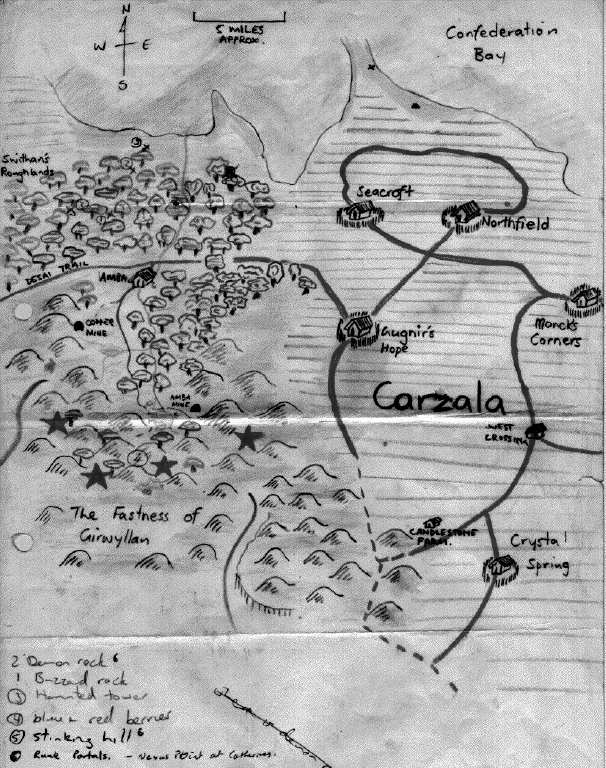
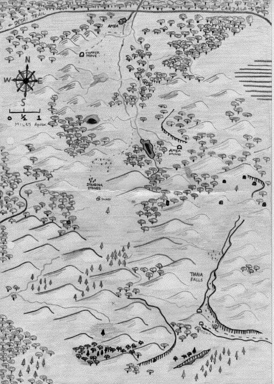

# The Mission

Notes from the Guild party hired by Martin to go into the high mana zone
west of Seagate.

## The Party Members

Jedburgh
:   A large man tanking around in plate armour with a broadsword and
    shield. Was previously a common soldier and now party scribe and
    military leader.

Mitothin
:   A female elven necromancer, although she should really find a
    college better suited to herself (like E & E, where you don't get
    your hands dirty). Party leader for a while.

Billy
:   A loose dwarf on the deck, able to mind mage backfire himself into
    oblivion in a single cast. Good with a battle axe though, and a
    decent dwarf.

Scab
:   A downtrodden and oppressed orc. A wicca by profession and a low
    life by confession. Needs to be clipped around the head often to be
    kept in line but he's not all that bad.

Tharkûn
:   Another dwarven mind mage, but wanting to become a 'real' mage (ie E
    & E). Yet another decent dwarf with a good battle axe.

Stein
:   The third in the three pack of dwarves, complete with axe. An earth
    mage and party leader for the second half of the adventure.

Jaundice
:   A female human of middling beauty. A shapechanger at heart and just
    starting on the road towards a full Seagate adventurer. Also very
    partial to fire (ie Fire Mage).

## Map of the Area

# Diary

## June 30 1994 AP

At about 3 pm in the afternoon, after the Guild Meeting, we meet our
employer Martin. Martin wants are party of adventurers to escort him
into the high mana zone. He is looking for a ritual (that nature of
which does not concern us here) which he believes may be found in the
zone. There we are also met by Mordrin and Clemintine, two adventurers
who have been into the area before. They tell us of various places and
things within the zone.

-   Flowing Claw (a group of shape changing tigers)
-   The area makes people aggressive
-   Blue or red berries
-   Sturges feet
-   A big bear
-   Hydra in lake
-   The Wise Owl
-   The muffin monster (roof dweller) who knows a considerable amount
-   Use pine needles on our fires

They also told us how to find the Owl.

-   Go to the Goblin Tree (but they were not sure what this was)
-   Walk 3/4 hour south if dwarf (not sure about this one)
-   Find silver tree
-   Travel south east 15 miles
-   Find river
-   Travel down river to the rapids
-   Owl goes past the rapids every day

They also said it may be possible to find the Owl on the wooden
plattform in The Tall Tree. Have to take a wooden bowl full of air for
the air element which is up there.

About quarter to four we all met outside the Guild, ready to leave. We
travel for about three hours to Farmer Browns. We spent the night

## July 1 1994 AP

After getting up at dawn and leave for Martin's farm about 6am. At about
half eight we reach a hamlet, Westcrossing, at a crossroads. Outside of
village was a burnt out wagon, apparently destroyed by a party of
raiding Hobbits.

Mitothin starts talking to one of the locals. She got given a handful of
blue crystals. She puts some in Scab's hand, which then burns the skin.
The women then tells Mitothin where to find these crystals. In return
Tharkun offers to help the women's husband load a wagon and take it up
to Northfield.

About mid morning we reached Candlestone Farm, where Martin lives.
According the folklore, 'A while back, around Martin's gand father's
father's time, a circle of stones, surrounded by high mana, lit up for
about two years and then melted.'

We were told 'Don't use the shortcut to the north of standing stones at
night'.

We have a meal of nuts from the Tyre tree. The nuts are in season at the
moment. About an hour before noon we leave and return to Westcrossing,
two hours later. At about 6pm we arrive at Monch's Corner. There are
having festival celebrating the founding day of the village. We pay out
120 silvers for 4 kegs.

About 8:30pm some of the locals start a fright. Two of them manage to
kill each other by amazing bad luck. A lot of enjoyment is got out of
Tharkun controls Even Meaner, getting it to piss on Scab. All and all me
and the dwarves got wildly drunk. I managed to walk through the fire and
the dwarves managed to make a sign, saying 'Dwarves drunk here' in
runes, out of several of the tables.

## July 2 1994 AP

A little after dawn we left Monch's Corner. Just before leaving a young
women in white with black hair, Megan's daughter (or Megan herself,
according to the rumours), saying 'When the far wheel turn three shall
see, home will come the low to be.'

We also get a extra party member, Spec, son of the dead mayor (one of
the people who died the night previously). He is a young man with talent
of healing.

About 4ish we get to North Field. The vines we thought we were carrying
turned out giant earth worms, which when cut up and plowed up into the
fields, and they remove any wicca curses. Later we headed out of town
and stop in some woods.

## July 3 1994 AP

We rise at dawn. Get into Amba about three hours later. Apparently we
took a short cut somewhere. At Amba there is a house at the end of the
village where we can stay. Scab goes off and buys some muffins and puts
them in the rafters. We decide to go and see the witch but before we
manage to do anything a young woman pops in and say 'Scab, see me in the
river.' Scab says she is the watery bint, a water nymph, Clemitine. Spec
goes ga-ga over her. She offers to take us to the witch.

She gives us all some water and we rapidly travelled down the river into
some bog. Once we got there, Clemitine asks us some Glumlin berries and
Castleroot.

Clemintine tells us about what she knows of what is in the high man
zone.

-   Dark man who carries treasure and hides it with the hydra.
-   Invisible stalkers that smell of cinimon and eat sentient brains.
-   Ponds in the Blue Woods that should be avoided.
-   Weasels which know Clemintine and are friendly that lives in the
    woods NW by a lake.
-   Two unicorns, Silver and Gold.
-   Swithen, a ghost who was a ranger and is reputed to be helpful.
-   The ghost of the Shaper, who constructed a considerable amount of
    what is now in the high mana ara.
-   A cat.
-   The Hermit.
-   The Owl.
-   The hydra which lives at the head of Clemintine's river, in a small
    valley.
-   Tower south of the head of the river, which has a sixth floor which
    cannot be reached.
-   Cat people (The Flowing Claw) in grasslands to the NE of the
    Deadwoods.
-   Shape changers on the grass lands (see above about the Cat people).
-   Place of death (burial ground) SE of the cliffs to the south (east
    of the deadwood). Currently occupied by semi-undead birds and
    several necromancers (and possibly black mages). A place to avoid.
-   The Deadwood.
-   The Green Man, a powerful Shaman (Now gone to the plane of the
    Shaper).
-   There are off planer creatures that come out at night.

The witch tells us about the following

-   Three goblin tribes, one west, one south and one east.
-   Band of looting hobbits (about 35 of them).
-   Martin the Hermit, who lives off to the west (of her bog).
-   Harpies, which fled from around Amba into the high mana zone (noted
    in other scribe notes).
-   The gargoyles looted the harpies' lair.
-   Man (a summoner of sorts) lives north of the Deadwood.
-   A couple of uncontrolled earth elementals.
-   A forest full of fairy folk.

She asks that if we find and kills any trolls, to burn the bodies and
collect up that ash for her. She also asks for Randlewood (a reed),
which is used in a Black Mage ritual. She says that we should also look
out of stirges feet, as boiling them down and drinking the liquid
increases agility.

Early afternoon we head back to Amba. On the way we see a giant turtle
in the river. Back at Amba a murder of crows lifts off from the inn as
we arrive back. Scab climbs onto the roof of our house to look for the
roof dweller. While on there a group of children start throwing rocks at
him, rumoured to have been incited by Tharkun. One of the rocks brains
Scab and he falls off the roof, but it luckly caught by Tharkun.

When Scab awakes, lying on one of the beds, he attacks Tharkun. The
constable arrives and arrests Tharkun and me. Justine, the local healer,
an old woman, arrives to look at Scab and Tharkun and I wonder down to
the village klink. One the way we pass a badger. The village klink turns
out to a cellar in an old manor house. Once there Tharkun and I start a
game of cards and wait for the liquid lunch to arrive.

About half an hour later the party turn up at the jail with Mitothin
dead and Billy under guard. Apparently Billy and Stein met the badger,
who also happens to be the roof dweller, aka the fat weasel, who tells
them of a pond which, if they collect some water from it, will heal
Scab. They collect some of the water and return to pour it in Scab's
head. Justine thinks the dwarves are doing something evil to Scab, a
local hero, and runs off.

A group of town folk arrive but Scab refused to come out, even though he
had been healed, and then promptly runs through the crowd towards the
pub. At this time a rumour had started that Mitothin was a greater
summoner, the crowd broke when Scab ran straight through them, shouting
that he had died and was now an undead.

The local lord and his men then arrived to deal to this "summoner".
Mitothin says she isn't a summoner and Scab arrives to assure them she
is only a necromancer. A footnote at this point to say the village has a
local necro, totally evil, whom they are having great trouble with and
the last thing they want is another one. Mitothin says she is a white
necro but they don't buy it and attack her. Billy comes to her aid but
to no avail and she is killed. Billy also managed to kill two of the
local lord's men.

After hearing this I decided to fly Mitothin, that is her body, back to
the Guild on Starwings. Back at the Guild I drop off the body, fill in
the paper work at go to the pub.

Later in the afternoon I fly back to Amba with six guild sercurity who
interview the parties involved and fly the party back to the Guild. I
managed to crash badly and spent the night at the healers.

## July 6 1994

That morning we all meet Guild Security and are given a three hour
lecture on correct behaviour and the maintaining the Guild's upstanding
reputation. We are then forced to pay for the three resurrections
(Mitothin plus the two dead locals) costing a total of 13,500 silver
pennies. Our punishment also includes one month of pennance doing dirty
work around the Guild.

Mitothin also has Spec's old man resurrected and to her disgust he
indentures him to her.

## July 7 1994

We set off back to Amba.

## July 10 1994

Early morning Scab and myself go into Amba to collect our horses and
Tharkun's mule and a keg or three for supplies, while the remainder of
the party go around on the western side. A couple of miles south of the
village we the air elemental. After a short while it rains into the
wooden bowl which we a put down on the grass. Drinking the water in the
bowl enabled us to see the elemental.

He says goblins have chopped his tree down in retribution for the
disappearance of they shaman, who in fact went to another plane via the
stone ring. He asks us to put his tower back up and in return we will be
able to talk to the owl. The water in the bowl also enabled us to see
walking unseen for a while, the people looking thin and wispy.

We pass some farmers on the way into the high mana zone on the road
which leads south from Amba who tell us a wagon with five dwarfs headed
pass this way about five days before hand. Martin tells us that we need
to find seven crystals which he needs for the ritual. Someone also said
that one of the crystals is one of the teeth of the hydra. Apperently in
the valley which the hydra lives a pond which glows at night and the
future can be seen in it.

At this point we had some idea of where the crytals where.

-   At the source of the river in the south.
-   A tooth of the hydra.
-   North of river hill south of the big tree, in a tomb on an island.
    This is believed to be the red crystal.
-   A madman collected some of them. Last seen around the Deadwood and
    the Dead lands.
-   A dryad has one and we should ask the owl about it.

The elemental tells us some of what is around here and what can be done.

-   If you fill a new turtle shell with pine needles and fill it with
    water pond (which one I don't know) the it enables you to cast mind
    mage spells. He notes that turtles are real quick around here but it
    is possible to remove the shell without killing the turtle.
-   Get a dwarven nose and hollow it out. Put skin over metal with gold
    mixed with it. It the metal onto the end of a stick and you can
    smell gold.
-   The ex goblin chief is a wicca hermit but he should not be mentioned
    in front of any goblins.
-   The summoner summons elementals rather than demons.

Soon after six badgers sprint past us we are attack by a 10 hex bear, 14
feet across the shoulder. We escape by sacrificing one of the horses. A
while after that we reach a pond and collect some randleweed. One of
Scab's dogs is hit with a jade tipped fairy folk arrow while trying to
catch frogs.

After a while we reach the standing stones. There are seven of them.
Each one has a day and a colour and the incription 'Welcome to our
world.' in dwarven runes.

-   Sunday (red)
-   Monday (green)
-   Tuesday (violet)
-   Wednesday (blue)
-   Thursday (orange)
-   Friday (indigo)
-   Saturday (yellow)

The area inside the stones is an elemental place of power and an
entities place of power even more so. Inside is also a burial ground and
the bodies of the dwarves that made the circle are buried under each
stone.

The circle is an important inter-planer gateway and is an aid for all
summoning. At night off-planer creatures able to come through the
circle.

Scab divinated the stones and got the following answers.

-   About 12 days ago the stones were affected by Rank 6 tunnelling.
-   Some one locating the stones.
-   The stones will bless unborn children on some full moons.
-   About 10 months ago, on a fullmoon, the stones where used in
    conjunction with some of the stones for a focus to create an
    inter-planer gateway.
-   Built by dwarves who are now guardian to the plane of death.
-   Entities get +6 Ranks on all spells.
-   Elementals get +3 Ranks on all spells.
-   Shadow wings cast on stones some time back.
-   Armour of earth cast some time back.

After a while we followed the air elemental as he headed off over the
grasslands to the south. While at the standing stones we had seen a pack
of about a dozen dogs come within half a mile of us but we did not see
them as we travelled through the grass. The grass on the plains was
about 5' tall and difficult see in.

Half way across the plains we reached an abandoned dwarven colony, which
consisted of a large collection of tunnels, 35 feet below the surface,
with about 45 skylights scattered around.

The dwarves decided that about 100 to 200 dwarves could have lived here.
Meaner smelt a troll in the tunnels and Mitothin said there were four
lesser undead. Near one of the skylights was patch of earth had been
burned about four days ago by a fireball.

After a while of searching around the area using ESP the troll made an
appearance, going after our horses. It was duely killed and burnt, with
the ashes collected up in two large sacks. The wood can from an old tree
with had been dumped into one of the skylight holes (each hole was
around 15' round).

As we headed off east we saw some people with dogs in the distance.
Beyond the plains was an area of low, leafy plants. Here resided some
large, man eating trapdoor spiders. Within the leafy area we could see a
skeleton of a horse with a sword and amulet next to it.

Mitothin manages to trip one of the spider's threads and it leaps out
and pulls her back into its lair. After a quick and nasty fight we
rescue her and gain some loot consisting of the following.

-   4 dwarven battle axes
-   1 set of dwarven chainmail
-   1 set of dwarven platemail
-   693 gold coins
-   4 silver coins

## July 11 1994

After an uneventful night in a hollow we head off towards where we think
the air elemental's tower was. A while after noon we reach his tree. It
is about 70' tall and far to large for us to put back up on our own.
Therefore we headed eastward to get the goblins to help us and camp near
some woods.

During the night we were attacked by a necromancer, his orc mercenary,
some zombies and a ghoul. All were defeated and the orc taken prisoner.
The loot list included the following.

-   A magic staff
-   Some silver candlesticks
-   A book titled "Knowledge of Death"
-   4 rings
-   Some general equipment
-   A map of the area

Mitothin exercises her right to choose her first item from the loot and
takes the staff. The staff takes her into "limbo" between life and
death where she meets Garioth. After a scuffle with Scab she breaks the
staff and curses herself with -20% off all her base changes.

The necro was an accolate to the big nasty necro around Amba, who is
planning to take over the world with hordes of undead, using the stones
to aid him. The party manages to backfire themselves into blindness,
deafness and amnesia.

## July 13 1994 AP

Clemintine takes us up the river back to Kathrine's place and them on to
Seagate.

## July 15 1994 AP

We arrive at the Guild and the party spends the day getting curses
removed. The loot list up to this point is the following.

|  **Items**                              |   **SP** |
|  -------------------------------------- | -------- |
|  Short sword                            |      800 |
|  Greate Clan Battle Axes (1,570 each)   |    4,710 |
|  Vengence Battle Axes                   |    2,000 |
|  Plate Mail Armour                      |    3,200 |
|  Chain Mail Armour                      |    4,400 |
|  Ring of the Flame                      |    1,000 |
|  Gold coins                             |    8,316 |
|  Silver coins                           |       77 |
|  General equipment                      |    1,790 |
|  Map                                    |      500 |
|  Three normal rings                     |       20 |
|  Silver and copper secured Tome         |    1,400 |

## July 16 1994 AP

Another not very exciting day passes.

## July 17 1994 AP

Clementine takes us back to Kathrine's and we decide to spend the night
there. Clementine gives us 20 Rk 12 Waters of Strength and Kathrine
gives us 4 packets of Trolldust.

We meet Feldo and Gross, who gargoyles, an Earth Mage and an E % E,
respectively. We all get Rk 20 Armour of Earth, Rk 18 Strength of Stone
and Rk 20 Lesser Enchantments.

That night we are attacked by a Mind Mage Undetectable Hellhound, which
we knew was after Mitothin. Martin, Spec and Jaundice get killed after
we were all hit by TK Rage.

## July 18 1994 AP

We get back to the Guild, leaving Scab and Stein behind. It costs us
13,000 silver pennies for the resurrections. We sell the gear of the
dead soldier for 1,200 silver pennies.

## July 20 1994

Get to Amba after two days travel. Collect Scab and Stein and go into
the high mana zone.

## July 21 1994

After finding some Glumlin berries we find Clemintine's River and call
her. Clemintine arrives, takes the berries and returns a couple of hours
later with 73 Waters of Healing. We collect some more berries for her
and camp for the night.

## July 22 1994

We attack the hydra and kill it. An elf and a human had just before us
attacked the hydra and failed (and got themselves killed). Billy
backfires an ESP and get virulent skin disease. Mitothin flees and has
to be rescued from some spiders by Tharkun, Stein and Jaundice. Mitothin
hits the bottle and in a state of drunken stupor resigns from party
leader. Stein is instated as the new party leader and promptly has
Mitothin thrown in the water to sober her up.

After digging for a long while we find a small chest containing a tea
set.

## July 23 1994 AP

Take a day to get to the head of the river.

## July 24 1994 AP

Search for crystal but do not find it. Discover red crystal effects time
around it to 75' feet so that anything within that area feel time pass
much more slowly.

## July 25 1994 AP

Head down the river.

## July 26 1994 AP

Bury red crystal near water fall. Find the green crystal in a tomb on an
island just south of river hill. Afterwards head towards dead area to
the SW. Attacked by vultures and ravens during the day so retreat to
cliff edge. That night attack by vultures and I get badly injured. Then
attacked by a necro but "rescued" by the harpies. They have Mordrin's
sword. They force us the cut of Scab's hand.

|  **Items** |
|  -------------------------------------- |
|  Amulet of Elderflowers |
|  Amulet of luck |
|  Amulet of Diamonds |
|  Four Hellfire rings from the harpies |
|  Two sets of chainmail |
|  One set of leather armour |
|  Two battle axes |
|  Two kite shields |
|  Six rings from various bodies |

We spent the remainder of the night sheltered in a nearby cave, which
was otherwise unoccupied.

## July 27 1994 AP

We head SW around the cliffs towards the deadwood. We spotted a group of
about 25 hobbits with a caravan so we quickly fleed north east up onto
the top of the cliffs. At the edge of the deadwood is a large patch of
plants with red berries so we collect a sackful. Off in the distance we
hear the hobbits being attacked. We spot some things flying in the
distance and we assume that the harpies attacked them. A quick check
revealed the caravan burnt out and several hobbits in hiding but we
don't investigate closely.

To the north of the deadwood, north east of the area of barren land with
a lake, a fire pit, a column of air, a hole in the ground and a large
tree in the middle, and north west of a large grass area, we come across
a hut. Inside lives an old man called Matthrew and his wife Jasper.

Matthrew heals Scab's missing hand and my grevious injury with the help
of the berries and the tea set we got from the hydra, out of the shadow
of Mitothin, since Necromancer's effect its power. We give him the tea
set in return for his help. He tells us the the following.

-   The Elementalist is insane.
-   There is a rogue earth elemental around.
-   Throwing off a recently severed hand off the cliff increases the
    thrower's MD by one.
-   If one hobbit throws a dead hobbit of the cliff then the thrower
    gets to grow bigger.
-   Matthrew of Governer's Hope is a weaponsmith.
-   The original dwarves who made the stone ring came from Candlestone.
-   Blue crystals (orc poison) and the red berries mixed together can
    bind an earth elemental.
-   In the middle of the summoning area is a sentient, carnivirous tree.
-   Clemintine gets her red berries from the goblins (before their
    shaman went off plane).
-   The healing Billy and Stein got for Scab was from the badger's
    glade.
-   He is a seer.
-   SF and Dillenger (Guild memebers of known dispute) had visited early
    and he did not find them agreable.
-   The Elementalist has four of the crystals.

The party, excluding Scab and myself, went with Jasper to the home of
the shapechangers. Scab and I followed later. During the time we were
away the party had entered the shaperchangers' village. In the middle of
the village was a dwarf holding a giant gem stone. The light from the
gem helps the shapechangers' between their forms, especially if trapped
in animal form. The dwarf holding it was apparently not dead, merely
trapped in time by his greed. He would become free if the gem was
removed from his hands but any dwarf who held it would become trapped.

The also tell us of the area.

-   Swamp north of the stones lets to travel to other swamps around, but
    it is infested with fairy folk, so people attempting to use it
    should talk with the dryads.
-   The dead area has at least six necromancers and several black mages.
    All of them are elves. Some note about something (a rod?) turns
    necromancers evil.
-   The invisible stalkers have cinnimon breath and tinker bells.
-   The Owl's rapids are below River Hill.

The evening Billy and Tharkun lose a nose each in a ritual to make gold
sniffers. Afterwards they ride some werewolves to collect tyne nuts,
which are excelent preservatives (preserve red berries). That night Scab
is turned into a snake and does snakey things and Mitothin gets laid by
two shapechanging elves. Unofficial sources have it she is now pregnant
with kittens (shapechanger cats of a sort).

## July 28, 1994 AP

We head of west to where the summoner (the Elementalist) lives with
Billy and Tharkun carrying a mat with orc dust and red berries smeared
over it (in case we had met the earth elemental). After an hour we reach
a giant fence and head to were we think the summoner lives.

Reaching it we found a huge complex of trenches dug around the area with
the summoner continuing to dig them. When we reach him we wanted to know
if you were after his red boots. At that point we a again attacked by
the harpies who give us a scroll to take back to the Guild.

The summoner asks for a couple of goats in return for borrowing the
crystals so Stein summons some and we manage to capture one and kill an
other.

The dwarves (because they are earth dwellers) are able to sink into the
ground and 'walk' through it and doing so blesses them. We enter the
summoner's abode, which is underground. It as a beautiful blue stone
floor.

The summoner tells us some of what he knows of the area.

-   Dwarves must throw their hands over the cliff +/- 10 days around the
    equinox. Humans must do it on the equinox.
-   Using the stone circle it is possible to talk to the shaper, and on
    a full moon travel to his plane.
-   To enter limbo, you should take the black berries from the swamp,
    which are poisonous, have a healer preserve dead on you, and
    neautralise poison to bring you back.
-   The cave to the west of here is where the earth elemental lives.
-   The cinnimon smelling, invisible skalkers are in fact (as far as I
    can make out) were shapechanger sheep. The fence along the western
    side of the elemental area is to keep them out.

## August 2, 1994 AP

The dwarves discovered the summoner was using old dwarven rum as the
weed killer the quickly remidied the situation by drinking all eight
barrels. It only took them six days. Meaner, the last of Scab's dogs,
died to alcohol poisoning during that time.

About mid morning the earth elemental visits and pile drives Scab into
the ground but using the mat we manage to control it.

If you die in the high mana area you cannot be resurrected outside of
the area but you can be dead for all long time (much longer than the
usual eighty to one hundred hours) before you die permanantly. This is
because the shaper wanted to become immortal and hoped never to leave.
To this end souls tend to get trapped here rather than leave the area.

## August 4, 1994 AP

Yesterday Scab went off with the earth elemental to throw his hand off
the cliff, travelling underground. He came back very broken but alive
(just).

About midday we collect some pine needles and head off to the dryads'
forest. We get the last crystal and Mitothin gets laid again, this time
by a couple of satyrs (according to Jaundice).

We then travel east to the swamp by the river and collect some reeds.
These reeds, when tied to you, stop the fish and other aquatic life from
attacking you when you get the green water.

We then head up to the head of the river and collect twelve bottles of
green water. This was done by standing on one of the pieces of floating
land, sinking down to the bottom, collecting the water from the bottom
and then swimming back up with somebody there to pull you out. Jaundice
bravely did this for us.

We then headed on to collect the red crystal, which we had left. By
putting it in bowl and pouring some green water over it, we neutralised
its time dilation effects.

## August 4, 1994 AP

We get the earth elemental to help us put the air elemental's tree back
up and the send it back to the summoner. We then travel east towards
Candlestone farm.

## August 6, 1994 AP

Scab summons a huge vampire bat and we get a dead hobbit dropped on us
by a harpy.

## August 7, 1994 AP

Arrive at Candlestone farm and drop off crystals to Martin. Get back to
Guild late in the evening. Security convinces Scab to have the bat
exterminated.

## August 8, 1994 AP

A deputation from the Superstition Mountains had arrived at the Guild
trying to discover something about the Clan Battle Axes. Apparently the
ones we found were the ones they wanted so there was a three day
drinking fest with a couple of hundred dwarves.

## August 11, 1994 AP

Head off to the Superstition Mountains with the dwarves and a Guild
representitive.

## August 14, 1994 AP

Get to Superstition Mountains and party some more. Tharkun adopted into
the Mueler Clan.

## August 22, 1994 AP

Arrive back at the Guild with four ingots of gold.

# Footnote

Apparently Candlestone farm was badly damaged by fire sometime after we
arrived back at the Guild. The harpies are known to be involved. No more
information is available at this point and it is not clear Martin
managed to complete the ritual.
