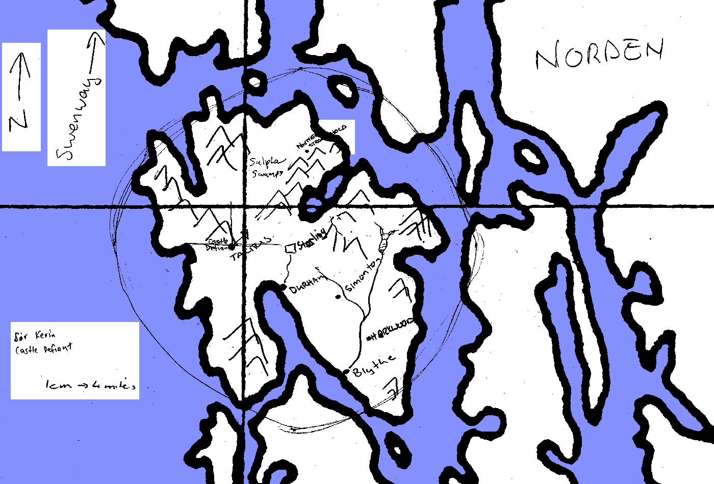
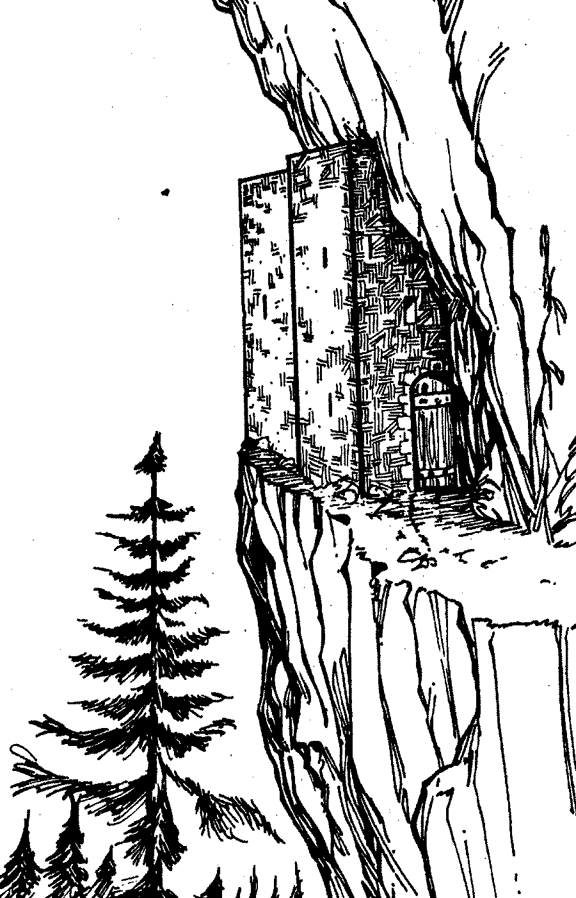

> Notes from the Guild party hired by Lord Peredur of Stirling to find
> and rescue his daughter Bronwyn from Bolgan the bandit.

# The Mission

The Guild party was hired by Lord Peredur of Stirling to find and
rescue his daughter Bronwyn from Bolgan the bandit.

<sect1>The Party Members

Jedburgh
: A large man tanking around in plate armour with a broadsword and
shield.  Was previously a common soldier and now party scribe.

Ishamael
: A tall, wild haired human dressed in black.  A dark celestial mage
of limited ability but a competent fighter, if light on armour and
shield.

Antonio
: A human cursed by the gods and now has plants growing out of
him.  One plant in particular has alcoholic berries so he is almost
permanently intoxicated.  An air mage with one mean Bolt of Ice.

Kilroy
: A dirty little peasant but an excellent rune mage.  Adept at getting
up to petty mischief and trickery.

Uraagh
: A heavy combat orc.  Has a great axe and knows how to use it.  The
party leader due to experience.

## Map of the Area

A map of the area around Stirling redrawn from maps on the Guild
library.

# Diary

## October 2 1992 AP

Meet Conal of Stirling in the Guild pub.  He says he is looking for a
group of adventurers to help his father, Lord Peredur of Stirling.  We
decide to help him out and get a Guild rep to fill in the paper work.
The payment of 3,000 silver pennies per member was agreed-ed upon for
rescuing his sister Bronwyn and another 7,000 each for killing the
dwarf bandit Bolgan and his followers.  Conal pays us each 1,000
silvers up front.

## October 3 1992 AP

We hired a ranger from the Guild to guide us up the coast.  Kilroy and
Garth fly up the coast on shadow wings from a ring given to him by
Conal.  Every 150 miles Kilroy creates a rune portal.

## October 5 1992 AP

Late in the afternoon we meet an old hermit Brother Darlis living on a
small island off the coast.  We repair his hut and in return he gives
each of us a healing potion (10 points).

That evening we reach Stirling, a small Barony consisting of a medium
sized island next to Norden and Swenway.  We are taken to Keep
Stirling, Lord Peredur's castle some six miles from the nearest town,
Durham on the coast.

After a good meal we meet Lyondel, Lord Peredur's elven advisor.  The
Lord himself was away at the time, and at the time of the kidnapping,
on a trade mission with most of his men.

Bolgan the dwarf had demanded 100,000 silver pennies for the return of
Lady Bronwyn.  Lyondel also says there has been trouble around the
mines near Castle Defiant, some miles to west and that Bolgan may be
trying to take it.

## October 6 1992 AP

During the previous night Kilroy managed to enter Lady Bronwyn's
dreams to discover there more than a dozen kidnappers and that see was
been held bound and gagged in a cell in a cave complex not two miles
from the coast.

Lyondel is a solar celestial mage and is able to cast star wings so we
fly over to Castle Defiant where we a met by Sir Kirrin.  He currently
had less than a dozen people defending the castle so Kilroy negotiates
with him for us to help in its defense if it is attacked.

Kilroy creates a portal between Castle Defiant and Keep Stirling so
troops could be quickly moved if either is attacked.  Uraagh and
Antonio decide to fly north to have a look around.  On their trip they
meet an orc which they kill and Uraagh manages to destroy his armour
in a sulphur swamp.

Around noon Ethrin, Sir Kirrin's ranger, returned from scouting badly
shot up so we took him back to the Guild for healing.  We returned
around three hours after noon.  Ethrin says he was attacked several
miles south of Castle Defiant.

After flying around the area south of Castle Defiant for a couple of
unsuccessful hours I decided to head back to Seagate and buy ten heavy
crossbows, five for myself and five for Uraagh.  We then fortified
Castle Defiant in preparation for attack.

Around eight in the evening ten orcs approach Castle Defiant.  Kilroy
performs a visitation to find another twelve hidden close by.

The attacking orcs were defeated but the gates of the castle were
destroyed.  Kilroy saw a dwarf (we assume Bolgan) and several orcs
escape.  Taticus, a town near to Castle Defiant, was also attacked and
destroyed.

We go and rescue the women and children who had been taken prisoners
in a mine not far away.  Kilroy goes overboard with one of women, and
later helps her set a shop somewhere around Seagate.  Sir Kirrin pays
us 2,800 silver pennies worth of tin for our aid.

## October 7 1992 AP

The previous Kilroy again entered Bronwyn's dreams and was able to get
that she was been held in a place called the Northern Stronghold.

We flew north to search of the old stronghold with Conal coming with
us.  As we approached the stronghold, which lies inset into a high
cliff side with only a narrow mountain path for access, we were
attacked.

Kilroy saved the day with an item which makes a 5' opening in any door
or wall.  We stormed the stronghold and killed all the defenders
except one orc.  Bolgan was among the dead and Lady Bronwyn was also
there, unharmed.

The loot included

* A rank six crystal of vision.
* A magical rock which if cast at creates a rank ten wall of stone.
* A magical two handed sword.
* A good set of orc sized rank eight armour smithed full plate.
* A set of dwarven plate, dwarven scale and a war hammer.
* Two great axes.
* A ring containing two charges of invested rank six troll-skin.
* A ring containing three charges of invested rank eleven armour of earth.
* A magical double bladed dagger.
* A silvered vanbrace.
* A nice belt.
* The skull of a snow serpent.
* A chest containing coins to the value of 1,920 silver pennies.

Kilroy creates a portal back to Keep Stirling.  We took the loot but
left the bodies.  The stronghold had a cave complex around it but the
doors into them were barred.

## October 8 1992 AP

We returned to the stronghold via the portal but had star wings on in
case of an emergency.  We found the bodies gone so Kilroy destroyed
the portal and we went down to the flat land below the stronghold.

Kilroy did a visitation into the cave complex.  He says he saw some
semi intelligent insects and a trapped illusionist baby dragon.  While
he was performing the visitation we were attacked by a monster from a
nearby swamp.

Lyondel asks us to take a couple of books to a friend of his in
Brastor.  We decided to portal back to the Guild that evening but were
interrupted.

## October 9 1992 AP

I wake up in a cell.  It turns out we had inadvertently put a portal
in a restricted area on Margalane.  After each of us paid a 1,000
silver penny fine for trespass we are put on a boat to the mainland.

## October 10 1992 AP

We arrived back in Seagate during the morning.  Ishamael decided not
to come with us to Brastor.  We find a portal going to near Brastor
and some of us buy horses.  That evening we take the portal and ride
into Brastor.  Lyondel's friend Captain Bloodaxe was currently serving
out at Coth Gap That night we have a wild outing on the town.

## October 11 1992 AP

We spent an uneventful day riding east and the night in a town tavern
with a group of troops under Corporal Cottle.

## October 12 1992 AP

Around noon we where attacked by a group of brigands.  Five of them
were killed with three taken prisoner.  I upgraded my horse to a top
of the line palfrey.

That afternoon we reach Coth Gap on the edge of the sea of grass.
Corporal Beaucannon, the commander in charge, says Bloodaxe has gone
out to find his pony with a person called Hightfoot.

Kilroy had set up a rune stick in his tent and went on a recognisence*
flight.  He returns saying he's seen Bloodaxe and that he was about to
be attacked by plainsmen.

We go through the portal to ambush the attackers.  In the fight I got
killed by a spear through my eye.

## October 13 1992 AP

I got resurrected and and over the next five days my eye repaired, at
a considerable expense.

## October 17 1992 AP

We met up with another party who had finished their mission so we
decided to investigate some unusual disturbances not far away.  The
party consisted by myself, Uraagh, Kilroy, Torinsin, a rune mage
looking like primitive man, Eliessa, a female mindless mage, Bragen,
an earth mage of reasonable talent and Charis, an elven binder with
two rag and string golems, Bob and Kate.

Torinsin had been the scribe on his earlier mission so he recorded the
events of that side trip.
