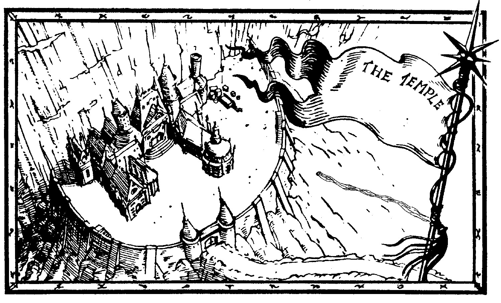

# Introduction

## Guild members on the Adventure

Ishamael
: A Dark Celestial with pretension to being a fighter one day.  A nice
person, really.

Sasha
: A human E&E who can actually fight quick well.  Excessively
grumpy though.

Nendil
: The water mage who will is somebody very useful to know.

Darien
: Party leader and the other type of Celestial (shadow, obviously, the
solar and star don't count at all).  Has an estoc and knows how to use
it.

Muerte
: The witch, the witch.  Evil, and with no style.

## Other people with the party

Peter
: Sasha toy boy.

Grobbenbonk
: Party employer and rune mage.  A goblin to boot (which is what you
do with most goblins, at least according the the orcs).

Grog
: An ogre earth mage.  Death aspected twin of Grug and hireling of
Grobbenbonk.

Grug
: An ogre warrior.  See Grog.

# Diary

## October 1 1994 AP

We meet Grobbenbonk and the two ogres and portal through to his tower.
From there we pass through Orctown and up the White River.

## October 2 1994 AP

During the morning we are passed by a dozen hobgoblins chasing two
goats.  We avoid them and continue on til dawn.  Around dusk we are
attacked by a group of goblins, who are quickly defeated.  One of them
was carrying a dwarven weaponsmithed dagger.

Several hours later we see a pack of direwolves attacking a band of
dwarves.  The dwarves are defeated so we parley with the dire wolves,
who know Sasha (and vice versa).  We find out the dragon in the ruined
city is female and a mind mage.

## October 3 1994 AP

I see a Rok during the morning's travels.  Below is the watch order.

| Time        |           |             |          |
| ---         | ---       | ---         | ---      |
| 7 -- 11	  | Grug	  | Sasha		| Muerte   |
| 11 -- 3	  | Peter	  | Grobbenbonk	| Nendil   |
| 3 -- 7	  | Ishamael  | Grog		| Darien   |

During the day a body is washed down the river.  From it we collect
various items of interest.

| PC             | Item                                                                      |
| ------------   | ------------------------------------------------------------------------- |
| Peter          | Amulet of luck                                                            |
| Muerte         | Amulet of Elder flowers                                                   |
| Grobbenbonk    | Amulet of jade (keeps away undead)                                        |
| Ishamael       | Rank 7 Restorative and Rank 8 Waters of Healing                           |
| Darien         | Rank 7 Restorative and Rank 8 Waters of Healing                           |
|                | Pouch and teleporting gold coin                                           |
|                | Broadsword (+10 SC), does [D-5] / fatigue expended (3 max) fire damage    |
| Nendil         | Dagger which is able to hit spectral entities                             |
| Muerte         | Whip                                                                      |
| Ishamael       | Hard leather with no agility loss                                         |
| Nendil         | Cloak of blending, +5 DF, 2 * PC to see if still                          |
|                | Ring with unknown gold crest                                              |
| Sasha          | Ring which gives +20 DF                                                   |
|                | Unknown ring                                                              |
| Sasha          | Ring of Weapon of flames, Rank 10, 2 charges, BC 83                       |
|                | Ring with two snakes heads                                                |
| Darien         | Ring which gives +2 to number to stun                                     |
| Darien         | Ring of Quickness, Rank 10, 3 charges, BC 63                              |
| Grobbenbonk    | Ring of Shadowwings, Rk 1, 4 charges, BC 65                               |

Around dusk the two direwolves head off to Morgor (a greater summoner)
with the loot they took of the dwarves bodies.  About four hours later
we leave and reach the lake at midnight.  We cross without difficulty
to find a injured harpy on the other side.  It had been in a group
fighting some adventurers and afterward a pack of direwolves attacked
them.  Muerte kill it.  and we got two rings from the body and some
armour from the lake.

* Ring of Hellfire, Rank 10, 2 charges, BC 63.
* Ring of Hellfire, Rank 10, 2 charges, BC 63.
* Chainmail hauberk.

We climbed up the cliff next to the waterfall.  At the was a woman
called Dawn.  She is a mind mage with highest ranked spell Molecular
Rearrangement and a long lived sentient.  Note that she told us this,
but I don't believe she had any reason to lie.  Muerte believes she is
a shapechanged dragon.

## October 4, 1994 AP

We enter the river about three hours after midnight and travel for
three hours before being attacked by fossegrim.  We defeat all of
them, capturing three, putting them in a sack.  After another hour we
leave the river and rest.

That evening Dawn binds the wills of the fossegrims and they get their
hidden treasure and give it to Dawn.  Shortly before midnight we see
five stone giants in the distance as we travel.

## October 5, 1994 AP

We stop around daybreak and rest the day.  The fossegrim's treasure
included a piece of dark elemental and several thousand silvers worth
of gems and metals.  During the day we are attacked by two trolls
heading up to the temple.  After killing them we burnt their bodies.
They had no significant loot.  Leave at dusk.

## October 6, 1994 AP

A couple of hours after midnight we are attack by three yetis.  After
killing them and collecting their skins we travel til daybreak.

Just before dusk I saw a gryphon in the distance.  Soon after we leave.

## October 7, 1994 AP

During the early morning we are confronted by a snow serpent.  Sasha
manages to sleep it and Dawn binds its will so we were able to travel
on its back all the way up the the gate of the temple.  Dawn then
continues on up the mountain on the serpent while we enter the temple
grounds.

After three hours for purification and breakfast enter the temple
itself.  Inside the entrance to the temple are two amber statues of
lion-headed sea lions.  They tell us it is a bad idea to take weapons
(or items that can be used as a weapon, such as invested Hellfires,
etc) into the temple proper.  We heed their advice and leave them with
the statues.

We enter a room which has a pool in it which gives visions.  We
continue on past it into a hall with has a metal tapestry of armoured
figures.  After travelling for a while we find the font and get 20
doses of green fluid.  We leave Grobbenbonk and continue looking
around.

After going through a series of rooms with riddles to solve we reach a
Naga, who, after we each solved a puzzle, gave us six weeks of time
(which took no time at all) to learn any spells from our college we
were able to.

After leaving the Naga we made our way back to were Grobbenbonk was
going.  We find a rune portal and arrive outside the temple.  After
collecting our weapons we follow the tracks of to two ogres, which
lead down river.

Around dusk we catch up with the ogres.  Grobbenbonk had been knocked
out while trying to recover our weapons from the statues and was
unconscious.

## October 8, 1994 AP

Grobbenbonk manages to create a rune portal back to his tower.  From
there we head back to the Guild in time for breakfast.

